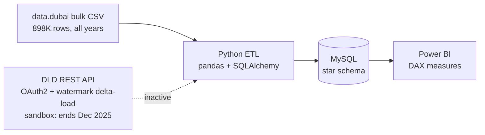
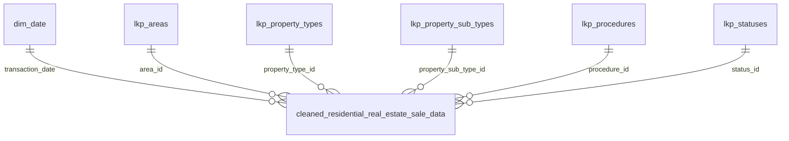

# Dubai Residential Real Estate — End-to-End Analytics Pipeline

**Bulk CSV → Python ETL → MySQL star schema → Power BI dashboard**


An end-to-end analytics system built on Dubai Land Department (DLD) transaction data. **898,413 raw rows** are cleaned down to **232,685 residential sales** (1 Jan 2024 – 2 Oct 2026, **AED 544.54bn** in total value), modelled as a star schema in MySQL and explored through an interactive Power BI dashboard.

> **Latest update (Oct 2026):** the DLD API this project was first built on turned out to be a sandbox that stops at December 2025. The warehouse is now fed from the full data.dubai bulk export and filtered to 2024 onward inside the ETL, so coverage runs through 2 October 2026. [Details below.](#from-api-to-bulk-csv-what-changed-and-why)

## At a glance

| | |
|---|---|
| **Coverage** | Dubai residential sales, 1 Jan 2024 – 2 Oct 2026 |
| **Cleaned transactions** | 232,685 |
| **Total sales value** | AED 544.54bn |
| **Market-wide median price** | AED 1,639 / sqft |
| **Raw input** | 898,413 rows × 47 columns (full bulk export, all years) |
| **Model** | 1 fact table, 5 lookup tables, 1 date table |

## Dashboard preview


*Overview: KPI cards, transactions by property type, median price/sqft by metro proximity, month-over-month trend, and Status / Year slicers.*


*Status = Existing: every visual recalculates, including the DAX-driven headline sentence.*


*Status = Off-Plan and Year = 2026: the Top Performing Area card flips to Madinat Al Mataar.*


*Top 10 areas by transaction volume on a Bing Maps visual, median price/sqft by property type and bedroom count, and the mall-proximity comparison.*

## Investment use case: "Where should AED 20M go?"

Most descriptive dashboards stop at reporting: total transactions, average price, month-over-month trend. This one is built so those numbers can support a decision. Given a fixed budget, where does the data point?

All price figures are **median AED per sqft** after IQR capping (the dashboard labels the measure "Avg Price per SqFt"). "2026 YTD" means 1 Jan – 2 Oct 2026.

### 1. Segment before looking at a single area

Off-plan and existing (resale) transactions behave like two different markets, so the Status slicer separates them first.

| Segment | 2024 | 2026 YTD | Change | Transactions (2024 → 2026 YTD) |
|---|---:|---:|---:|---|
| Existing (resale) | 1,229 | 1,426 | **+16.0%** | 29K → 15K |
| Off-plan | 1,688 | 1,772 | +5.0% | 53K → 40K |

Resale prices rose about three times faster than off-plan, and the off-plan premium over resale narrowed from 37% to 24%. (Resale in 2025 sat at 1,382, so the climb has continued into 2026.)

One level down, the picture sharpens:

| By property type | 2024 | 2026 YTD | Change |
|---|---:|---:|---:|
| Resale units | 1,234 | 1,403 | +13.8% |
| Off-plan units | 1,775 | 1,770 | −0.3% |
| Resale villas | 1,203 | 1,475 | +22.6% |
| Off-plan villas | 1,393 | 1,816 | +30.4% |

Off-plan **unit** pricing is flat. The off-plan headline gain comes from villas. Unit for unit, the off-plan premium over resale compressed from **44% to 26%**. A single blended number would have hidden all of this.

### 2. Find where momentum actually is

The "Top Performing Area By Transactions" card is DAX-driven and slicer-aware. Across the full window, **Al Barsha South Fourth** leads. Set Year to 2026 and leadership flips to **Madinat Al Mataar**, with or without the Off-Plan filter: activity is shifting toward a newer area, not just concentrating in an established one.

### 3. Weigh volume against price

The Top 10 Areas map puts the trade-off side by side:

- **Madinat Al Mataar:** 15,096 transactions at AED 1,601.85/sqft
- **Wadi Al Safa 5:** 13,111 transactions at AED 1,359.67/sqft

Similar volume, an 18% gap in price per sqft, and both trade below the market-wide median of AED 1,639.

### 4. Pick the right configuration

The "Avg Price per SqFt by Property Type and Rooms" scatter shows unit pricing climbing steeply with size: 6-bedroom units reach AED 3,711/sqft, about 2.3× the market median, while 1–3 bedroom units sit in a much tighter band. For a AED 20M allocation, that is the difference between one large asset and a spread of smaller units, and units account for 85.7% of all transactions. The visual shows medians but not group sizes, so thin segments such as 6-bedroom units need a count check before they are treated as a signal.

### 5. Quantify the amenity premium instead of assuming it

| Proximity | With | Without | Premium |
|---|---:|---:|---:|
| Metro | AED 1,660.53 | AED 1,620.55 | +2.5% |
| Mall | AED 1,662.18 | AED 1,620.38 | +2.6% |

Real, but modest. Neither is the dominant price driver in this dataset.

### What this is and isn't

It doesn't output a single "buy here" answer, and it isn't meant to; that call belongs to the investor and their advisors, and nothing here is investment advice. What it does is compress a question that would otherwise mean pulling raw DLD data and cross-referencing it by hand into a filter-driven walkthrough, and it forces the market to be segmented properly (off-plan vs. resale, unit vs. villa, complete vs. partial months) before any trend line gets trusted.

**Read the last month with care.** The data runs to 2 October 2026, so October holds only two days (344 transactions). Treat the final point of any month-over-month view as incomplete.

## From API to bulk CSV: what changed and why

The pipeline was originally built against the DLD Open Data API (OAuth2, watermark-based delta loading). While validating 2026 coverage I profiled the date range of the extract and found that the endpoint is a **test/sandbox environment**: the data is valid and well-formed, but only covers January 2024 – December 2025.

Rather than stitching two partial sources together, I downloaded the **entire historical transaction export as one bulk CSV** from the data.dubai portal and rebuilt the warehouse from that single source. The key design choice: the file is *not* pre-filtered by hand. The ETL itself keeps residential sales dated 2024 onward, so the whole path from raw file to warehouse is one reproducible script. The same date filter also removes legacy rows with impossible dates (the earliest parsed date in the raw export is in the year 1420).

The CSV uses the same schema as the original API extract, so cleaning, feature engineering and loading logic stayed the same. The API extraction code (OAuth2, watermark delta-load) is still in the repo; it is the intended path for automated incremental refreshes once the account has access to a live (non-sandbox) feed.

**The refresh is repeatable.** Two consecutive runs against re-downloaded exports:

| Run | Latest transaction date | Raw rows | Cleaned residential sales |
|---|---|---:|---:|
| Earlier run | 17 Sep 2026 | 892,125 | 230,038 |
| Latest run | 2 Oct 2026 | 898,413 | 232,685 |
| **Change** | +15 days | +6,288 | **+2,647** |

## Architecture



## Pipeline walkthrough

### Phase 1 — Extraction

**Current path: full bulk CSV reload**

- Reads the complete data.dubai transaction export (898,413 rows × 47 columns, all years and all transaction types)
- Reports the date range it received (latest: 2 Oct 2026) before anything is filtered

**API path (implemented, inactive)**

- Authenticates with the OAuth2 client-credentials flow; credentials live in a `.env` file
- Watermark-based delta loading: reads the maximum `instance_date` from the existing master file and pulls only newer records, cutting sync time from ~60 minutes to under 5 seconds
- WAF-compliant headers and a 50-minute token-lifespan guard for long extractions
- Paginates in descending date order and stops the moment it overlaps with existing data

### Phase 2 — Transformation

**The funnel**

| Stage | Rows |
|---|---:|
| Raw bulk export (all years, all usages and transaction types) | 898,413 |
| Dated 2024-01-01 or later | 327,317 |
| Residential **sales** only (shops and offices excluded) | 233,609 |
| Duplicate `transaction_id` rows found | 0 |
| Excluded by price/sqft market bounds | 924 (0.4%) |
| **Valid rows loaded** | **232,685** |
| Of those, capped to IQR fences (kept, not dropped) | 6,883 (3.0%) |

```
Raw data shape: (898413, 47)
max transaction date in raw data: 2026-10-02 00:00:00
Number of transactions from 2024-01-01 onwards: 327317
Number of transactions from 2024-01-01 onwards after Residential filter: 233609
Number of duplicate rows in raw data: 0

1. Rows Analyzed:           233609
2. Rows Forensically Saved: 0
3. Broken Rows Excluded:    924
4. Valid Rows Remaining:    232685
5. Luxury Outliers Capped:  6883
```

**Step 1 — Clean and filter**

- Drops Arabic-language columns, party-count columns, `load_timestamp`, and columns that are empty for sales (`rent_value`, `meter_rent_price`)
- Drops English name columns that already live in lookup tables (area, property type and sub-type, procedure, registration type)
- Keeps `Residential` usage and `Sales` transaction group; excludes Shop and Office room types
- Parses `instance_date` and keeps 2024 onward

**Step 2 — Deduplicate, type and handle nulls**

- Deduplicates on `transaction_id`
- Converts ID columns to memory-efficient nullable types (`UInt8`, `UInt16`, `boolean`)
- Fills structural nulls with deterministic rules by `property_type_id`, since the data is residential-only: Land → sub-type 6 (Residential Land), rooms "land", building "empty land"; Building → sub-type 5 (Residential Building), rooms "whole building", building "Independent Building"; Villa → sub-type 4, building "Villa"
- Properties outside any project get `project_number` 0 and "Independent Property" for project and master project
- Imputes missing `rooms` for villas and units by **nearest-median-area matching**: computes the median `procedure_area` for each known room category within the property type, then assigns each null row the category whose median is closest to its area

**Step 3 — Standardise and engineer features**

- Cleans `rooms` labels (removes "B/R", maps "Single Room" to 1, title-cases)
- Turns `nearest_metro`, `nearest_landmark` and `nearest_mall` into boolean flags (`has_nearest_*`)
- Converts area from m² to sqft (× 10.7639) and derives `price_per_sqft`

**Step 4 — Price-per-sqft quality gates**

1. **Market bounds by property type** (AED/sqft): Unit 300–15,000 · Villa 400–10,000 · Land 50–5,000 · Building 300–5,000
2. **Recovery pass:** flagged rows get `price_per_sqft` recalculated from price and area before being discarded. On this dataset it recovers **0 rows**, because `price_per_sqft` is itself derived from those two columns earlier in the pipeline. It works as a guard against upstream arithmetic errors, not as a source of rescued rows.
3. **IQR capping:** Tukey fences (1.5 × IQR) per property type clip extreme values into `price_per_sqft_capped`, which the dashboard uses

**Dimension table generation**

All five lookup tables share one normalisation pattern: select the ID and label columns, `drop_duplicates()`, reset the index. Nulls are handled deliberately rather than silently dropped: ID columns are filled with `0` (an explicit "unknown" key) and label columns with `"not provided"`, so every foreign key in the fact table always resolves to a row in its dimension table.

```python
property_sub_type_lookup = (
    data[['property_sub_type_id', 'property_sub_type']]
    .drop_duplicates(keep='first')
    .reset_index(drop=True)
)

property_sub_type_lookup['property_sub_type_id'] = property_sub_type_lookup['property_sub_type_id'].fillna(0)
property_sub_type_lookup['property_sub_type'] = property_sub_type_lookup['property_sub_type'].fillna("not provided")

property_sub_type_lookup.to_csv('property_sub_type_lookup.csv', index=False)
```

The same pattern is reused for `lkp_areas`, `lkp_property_types`, `lkp_procedures` and `lkp_statuses`.

### Phase 3 — Loading (MySQL data warehouse)

- Connects to a local MySQL instance (`real_estate_db`) through SQLAlchemy
- Loads the cleansed fact table with `if_exists='replace'` for a full refresh
- Loads the five lookup tables only if they do not already exist, so re-runs are safe and never duplicate dimensions

**Enforcing referential integrity**

`pandas.to_sql()` creates columns but doesn't enforce relationships, so the star schema is hardened with a one-time SQL pass: key columns are aligned to matching `INT` types, each dimension gets an explicit primary key, and the fact table gets a foreign key back to it. A bad load then fails loudly at the database level instead of surfacing weeks later as blank labels in Power BI.

```sql
-- Align dimension and fact key types
ALTER TABLE lkp_areas
MODIFY area_id INT;

ALTER TABLE cleaned_residential_real_estate_sale_data
MODIFY area_id INT;

-- Primary key on the dimension side
ALTER TABLE lkp_statuses
ADD PRIMARY KEY (status_id);

-- Foreign key on the fact side
ALTER TABLE cleaned_residential_real_estate_sale_data
ADD CONSTRAINT fk_fact_status
FOREIGN KEY (status_id) REFERENCES lkp_statuses(status_id);
```

The same pattern (type alignment → primary key → foreign key) is repeated for each of the five dimension tables. **Because `replace` drops and recreates the fact table, re-run the type-alignment and foreign-key statements after every full refresh.** The dimension primary keys persist; the fact-table constraints do not.

## Data model (star schema)



**Fact table key columns** (`cleaned_residential_real_estate_sale_data`)

| Column | Type | Description |
|---|---|---|
| `transaction_id` | VARCHAR | Unique transaction identifier |
| `transaction_date` | DATE | Date of the sale |
| `price` | DECIMAL | Total transaction value (AED) |
| `property_size_sqft` | DECIMAL | Property size in square feet |
| `price_per_sqft` | DECIMAL | Derived price per square foot |
| `price_per_sqft_capped` | DECIMAL | IQR-capped version used in visuals |
| `rooms` | VARCHAR | Bedroom category (Studio, 1, 2 … Penthouse, Whole Building, Land) |
| `area_id` | INT | FK → `lkp_areas` |
| `property_type_id` | UINT8 | FK → `lkp_property_types` |
| `property_sub_type_id` | UINT8 | FK → `lkp_property_sub_types` |
| `procedure_id` | UINT16 | FK → `lkp_procedures` |
| `status_id` | BOOLEAN | FK → `lkp_statuses` (Existing / Off-Plan) |
| `has_parking` | BOOLEAN | Parking availability flag |
| `has_nearest_metro` | BOOLEAN | Metro proximity flag |
| `has_nearest_landmark` | BOOLEAN | Landmark proximity flag |
| `has_nearest_mall` | BOOLEAN | Mall proximity flag |

## Power BI measures (DAX)

```dax
-- Median price per sqft (robust to luxury outliers).
-- Labelled "Avg" on the dashboard, computed as a median.
Avg Price per SqFt =
    MEDIAN(cleaned_residential_real_estate_sale_data[price_per_sqft_capped])

-- Dynamic headline that responds to slicer context
Market Insight Headline =
    IF(
        ISFILTERED('lkp_statuses'[status]),
        SELECTEDVALUE('lkp_statuses'[status]) & " Market Analysis: Avg Price is AED "
            & FORMAT([Avg Price per SqFt], "#,##0") & "/sqft",
        "Total Dubai Residential Market: Avg Price is AED "
            & FORMAT([Avg Price per SqFt], "#,##0") & "/sqft"
    )

-- Month-over-month transaction volume
Transactions Last Month =
    CALCULATE([Total_Transactions], DATEADD('dim_date'[Date], -1, MONTH))

MoM Transactions Growth % =
    DIVIDE(
        [Total_Transactions] - [Transactions Last Month],
        [Transactions Last Month],
        0
    )

-- Totals
Total Sales (AED)    = SUM(cleaned_residential_real_estate_sale_data[price])
Total_Transactions   = DISTINCTCOUNT(cleaned_residential_real_estate_sale_data[transaction_id])
```

## Project structure

```
├── etl_pipeline.py                 # Main ETL script (extract → transform → load)
├── dld_transactions_bulk.csv       # Full bulk export from data.dubai (gitignored)
├── lkp_areas.csv                   # Area dimension lookup
├── lkp_property_sub_types.csv      # Property sub-type lookup
├── lkp_property_types.csv          # Property type lookup
├── lkp_statuses.csv                # Status (Existing / Off-Plan) lookup
├── lkp_procedures.csv              # Procedure type lookup
├── images/                         # Dashboard screenshots used in this README
├── .env                            # Credentials (gitignored)
├── .gitignore
└── README.md
```

## Setup and usage

**Prerequisites:** Python 3.9+, MySQL 8.0+ running locally, Power BI Desktop.

**1. Install dependencies**

```bash
pip install pandas numpy sqlalchemy pymysql python-dotenv requests
```

**2. Create the database and credentials**

```sql
CREATE DATABASE real_estate_db;
```

Create a `.env` file in the project root (the DLD values are only needed for the API path):

```
MYSQL_PASSWORD=your_mysql_password
DLD_CLIENT_ID=your_client_id
DLD_CLIENT_SECRET=your_client_secret
DLD_APP_IDENTIFIER=your_app_identifier
```

**3. Get the data**

Download the complete transaction export as a bulk CSV from the data.dubai open-data portal and point the script at it. No manual filtering is needed; the ETL keeps residential sales from 2024 onward.

**4. Run the pipeline**

```bash
python etl_pipeline.py
```

**5. Connect Power BI**

Power BI Desktop → Get Data → MySQL Database → `localhost` / `real_estate_db` → load the fact table and all lookup tables → apply the DAX measures above.

**Refresh runbook**

1. Download the latest full export and replace the local CSV
2. Run `python etl_pipeline.py` (rebuilds the fact table; lookups are only created if missing)
3. Re-run the type-alignment and foreign-key SQL (see Phase 3)
4. Refresh the Power BI model

## Key engineering decisions

**Why reload from a bulk CSV instead of patching in 2026?** The API turned out to be a sandbox scoped to 2024–2025, a limitation that isn't documented up front and only surfaced once I profiled the returned date ranges. Reconciling two partial, independently sourced ranges invites subtle inconsistencies. One internally consistent source beats stitching two together.

**Why filter inside the ETL instead of pre-filtering the file?** The raw export stays untouched and the whole raw-to-warehouse path lives in one script, so anyone can reproduce the warehouse from the download alone. The same date filter also drops legacy rows with impossible dates.

**Why keep the API code?** It is tested, working, and the right tool for incremental refreshes once a live feed is available. Delta loading keeps sync time under 5 seconds regardless of dataset size.

**Why MEDIAN instead of AVERAGE for price per sqft?** Dubai's luxury segment produces extreme high-end outliers. MEDIAN resists them and represents the typical market participant; the IQR-capped column is a second safety net.

**Why a star schema instead of a flat table?** Dimension tables decouple descriptive attributes from the fact table, reduce storage, and keep Power BI relationships clean. Adding a new area or property type means updating one lookup table, not reloading the fact table.

**Why add primary and foreign keys after the load?** `to_sql()` will happily create a fact table whose `area_id` doesn't match anything in `lkp_areas`. Explicit constraints turn "these columns are supposed to match" into something MySQL rejects if violated.

**Why impute instead of drop?** Many nulls are structural (land has no rooms, a villa isn't a building). Rule-based fills and nearest-median-area matching keep valid sales in the dataset instead of discarding them.

**Why explicit "unknown" members in dimensions?** Filling IDs with `0` and labels with `"not provided"` guarantees that every fact row joins, so nothing disappears silently from a visual.

## Known limitations and next steps

- **Latest month is partial.** Data runs to 2 October 2026; any month-over-month view should be read with that in mind.
- **Manual refresh.** The dashboard is a Power BI Desktop file on a local MySQL instance and is not yet published to Power BI Service. Next step: publish with a scheduled refresh.
- **Constraints after full refresh.** `if_exists='replace'` recreates the fact table, which drops its foreign keys. Switching to truncate-and-append would let the constraints survive each refresh.
- **Incremental loading.** The watermark-based API path is ready for when a live (non-sandbox) feed is available.

## Data source

- **data.dubai open-data portal:** full historical transaction export (bulk CSV), the current source for the fact table. Filtered to 2024 onward inside the ETL.
- **DLD Open Data API:** test/sandbox endpoint covering January 2024 – December 2025 only. Implemented and functional but not used for the live warehouse. Access requires registration and approval by the DLD integration team; credentials are not included in this repository.

## Author

**Abdullah** · Data & BI Analyst · Dubai, UAE
Open to Data / BI Analyst opportunities in the UAE.

[LinkedIn]([https://www.linkedin.com/in/your-profile](https://www.linkedin.com/in/muhammad-abdullah-a7861a3a2/)) · [GitHub]([https://github.com/your-username](https://github.com/ak786abdullah))
